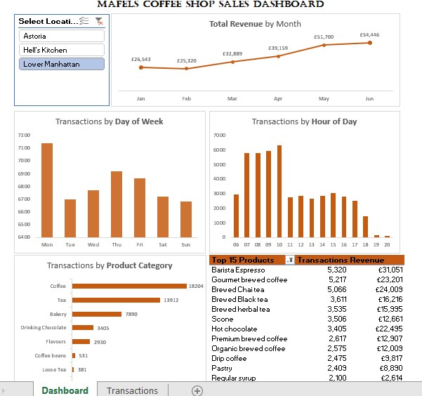

# Mafels Coffee Shop Sales Analysis Dashboard

## 📌 Project Overview
**Core Objective:** Analyzed sales transaction data for Mafels Coffee Shop from January 2023 to June 2023. The goal was to create an interactive dashboard to identify sales trends, peak operational hours, and top-performing products to drive strategic business decisions.

## 🛠️ Process & Methodology
The project was executed in three distinct stages:

### 1. Data Preparation
* Conducted initial data QA and profiling to understand transaction volume and product scope.
* Added a new column to calculate **Revenue**.
* Extracted **Month** and **Day of Week** from transaction dates.
* Extracted **Hour** from transaction timestamps to enable hourly analysis.

### 2. Data Analysis (Pivot Tables)
* Created views to analyze time series and product-level trends using Excel PivotTables.
* Analyzed revenue by month and transaction volume by day of week and hour of day.
* Sorted and filtered data to identify top product categories and the top 15 specific products by transaction volume and revenue.

### 3. Dashboard Visualization
* Built a dynamic dashboard using Pivot Charts to visualize insights.
* Designed the interface to facilitate the identification of actionable recommendations.

---
## 📊 Key Insights
### 1. Sales Performance & Growth
**Revenue Growth:** Monthly revenue doubled over the 6-month period, rising from **£81.6K in Jan** to **£166.5K in June**.
**Seasonality:** Following a slight dip in Feb (-6.7%), the shop experienced explosive growth in March (+29%), April (+20%), and May (+31%), indicating successful spring customer acquisition.
**Total Volume:** Generated **£698k** in total revenue across nearly **150,000 transactions**.

### 2. Operational Analysis (Peak Times)
**The Morning Rush:** Activity peaks sharply between **8:00 AM and 10:00 AM**, reaching up to 18,500 transactions per hour.
**The Drop-off:** Transaction volume drops by **50% after 10:00 AM** and plateaus for the remainder of the day.
**Daily Consistency:** Weekday traffic is consistent (~21.5k/day), while Saturdays are the slowest day (20.5k).

### 3. Product Trends
**Volume vs. Value:**
**Brewed Chai Tea** is the top seller by volume (17,183 sales).
**Barista Espresso** is the top revenue generator (£91k), driving high value per transaction.
**Consumer Preferences:** Hot Chocolate outperforms standard Drip Coffee, landing as the 4th best-selling item.
**Attach Rate:** Bakery items are a vital add-on, present in roughly 1 in 7 transactions.
  
### 4. Location Performance
**Uniform Success:** All three locations (Hell's Kitchen, Astoria, Lower Manhattan) perform at a nearly identical high level, each contributing ~£230k+ in revenue.

---
## 💡 Recommendations
Based on the data analysis, the following strategies are recommended:
### Operational Optimization
**Split-Shift Roster:** Maximize barista headcount during the **7 AM – 10 AM** window to handle extreme volume, and reduce staffing significantly after 11 AM to control labor costs.
**Weekend Push:** Launch a "Weekend Brunch Special" (e.g., Coffee + Pastry bundle) to incentivize visits on Saturdays, currently the slowest day.
### Product & Inventory Strategy
**Inventory Priority:** Ensure stock levels for **Chai ingredients** and **Espresso beans** are prioritized, as stockouts here would impact the majority of revenue.
**Happy Hour:** Introduce an "Afternoon Pick-Me-Up" Happy Hour (**2 PM – 4 PM**) with discounts on sugary treats or larger sizes to utilize excess capacity during the post-morning slump.
### Strategic Expansion
**Upselling:** With Bakery items currently in only ~15% of transactions, staff should be trained to upsell pairings (e.g., Scones with Chai) to increase the Average Transaction Value.
